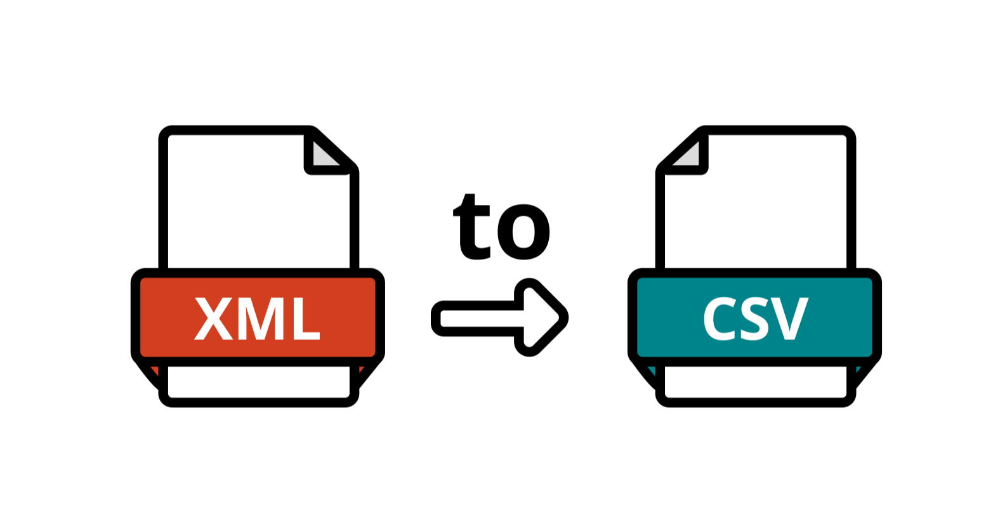
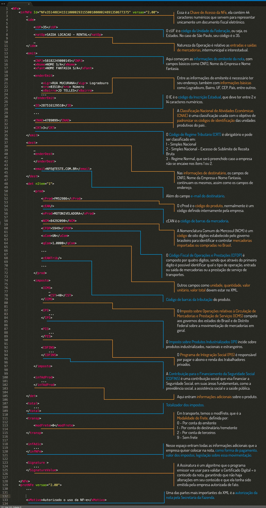

# Projeto de Conversão de NFe para CSV



[](https://opensource.org/licenses/MIT)
[](https://github.com/seu-usuario/seu-projeto)

## Índice

1. [Descrição do Projeto](#descricao-do-projeto)
2. [Status do Projeto](#status-do-projeto)
3. [Funcionalidades e Demonstração da Aplicação](#funcionalidades-e-demonstração-da-aplicação)
4. [Instruções de Utilização](#instruções-de-utilização)
5. [Acesso ao Projeto](#acesso-ao-projeto)
6. [Tecnologias Utilizadas](#tecnologias-utilizadas)
7. [Como Contribuir](#como-contribuir)
8. [Informações Adicionais](#informações-adicionais)
9. [Autores](#autores)
10. [Licença](#licenca)

## Descrição do Projeto

O Projeto de Conversão de NFe para CSV é uma ferramenta desenvolvida em Python 3 que extrai informações de Notas Fiscais Eletrônicas (NFe) no formato XML, realiza cálculos de impostos, e converte os dados para um formato CSV. Ele inclui funcionalidades como o cálculo de impostos do Simples Nacional e da Reforma Tributária, além de consultar taxas de IVA em um arquivo CSV relacionado.

## Status do Projeto

O projeto está em desenvolvimento e novas funcionalidades estão sendo adicionadas regularmente. Consulte o [badge de status](https://github.com/seu-usuario/seu-projeto) para obter informações atualizadas sobre o progresso.

## Funcionalidades e Demonstração da Aplicação

- Extração de dados de NFe em formato XML.
- Cálculo de impostos do Simples Nacional e da Reforma Tributária.
- Conversão de dados para CSV.
- Consulta de taxas de IVA em arquivo CSV.

## Instruções de Utilização

1. **Adição de Notas Fiscais Eletrônicas (NFe):**

- Coloque os arquivos XML das Notas Fiscais Eletrônicas na pasta input.

2. **Processamento Instantâneo:**

- Se deseja realizar o processamento instantâneo das notas, execute o software.

```
bash

python main.py
```
- Os arquivos CSV serão gerados na pasta output, um para cada arquivo XML.

3. **Processamento Agendado:**

- Se deseja agendar o processamento das notas para um momento específico, você pode utilizar ferramentas de agendamento de tarefas do sistema operacional ou criar um script que será executado automaticamente.

4. **Arquivos CSV com Valores Calculados:**

- Os arquivos CSV na pasta output conterão os valores calculados dos impostos da Nova Reforma Tributária.

5. **Arquivo Collection.CSV:**

- Ao final do processamento, um arquivo chamado Collection.CSV será criado na pasta output. Este arquivo conterá as informações de todas as notas XML processadas nessa batelada.

**Exemplo de Script para Agendamento (Linux):**

```
bash

# Abra o terminal e execute o seguinte comando:
crontab -e

# Adicione a seguinte linha para agendar o processamento diário às 2:00 AM:
0 2 * * * cd /caminho/do/seu/projeto && python main.py
```

- Lembre-se de substituir /caminho/do/seu/projeto pelo caminho real do seu projeto. Este exemplo realiza o processamento diariamente às 2:00 AM, mas você pode ajustar conforme necessário.

- Ao seguir essas instruções, você poderá processar as notas fiscais de forma instantânea ou agendada, obtendo arquivos CSV com os valores calculados dos impostos da Nova Reforma Tributária.

## Acesso ao Projeto

Para utilizar o projeto, siga as instruções abaixo:

1. Clone o repositório: `git clone https://github.com/seu-usuario/seu-projeto.git`
2. Instale as dependências: `pip install -r requirements.txt`
3. Execute o software: `python main.py`

## Tecnologias Utilizadas

- Python 3.8 ou superior
- lxml
- nfelib
- pandas
- BeautifulSoup
- Outras bibliotecas específicas listadas em `requirements.txt`

## Como Contribuir

Se você deseja contribuir para o projeto, siga os passos abaixo:

1. Faça um fork do repositório.
2. Crie uma branch para a sua contribuição: `git checkout -b feature/nova-funcionalidade`.
3. Faça as alterações desejadas.
4. Faça commit das suas alterações: `git commit -m 'Adiciona nova funcionalidade'`.
5. Faça push para a sua branch: `git push origin feature/nova-funcionalidade`.
6. Abra um pull request no repositório original.

## Informações Adicionais

1. **Tags / Campos xml**

- As NFes são compostas por tags / campos que carregam informações pertinentes. Para conhecer a definição de cada tag / campo, confira o site [vrsystem.info](https://vrsystem.info/publico/post?Id=354b9bb8-2d87-4bd7-9750-34755bd127b8).

2. **Estrutura de uma NFe**

- Caso não tenha familiaridade com o xml, sugerimos que veja como é a sua estrutura abaixo:



3. **Validações de nota**

- O validador XML, como o próprio nome sugere, é uma ferramenta que tem como objetivo validar os arquivos XML enviados de forma a minimizar a possibilidade de erros no processamento de documentos fiscais.
- A Sefaz disponibiliza essa ferramenta que serve de auxílio para todos os contribuintes de forma a validar o XML da nota, notificando se há algum erro ou não com o arquivo.
- Veja aqui o [Site do validador da SEFAZ](https://www.sefaz.rs.gov.br/nfe/nfe-val.aspx).

4. **Referencia**

- [Nota Técnica SEFAZ - Layout NF-e\NFC-e 4.0](https://www.nfe.fazenda.gov.br/portal/listaConteudo.aspx?tipoConteudo=04BIflQt1aY=)

## Autores

- Lucas Grogenski Meloca
- Jefter Leandro Polletti
- Deverson Rogerio Rando
- Betwel Zampieri Montanher

## Licença

Este projeto é licenciado sob a [Licença MIT](https://opensource.org/licenses/MIT) - veja o arquivo [LICENSE](LICENSE) para mais detalhes.
